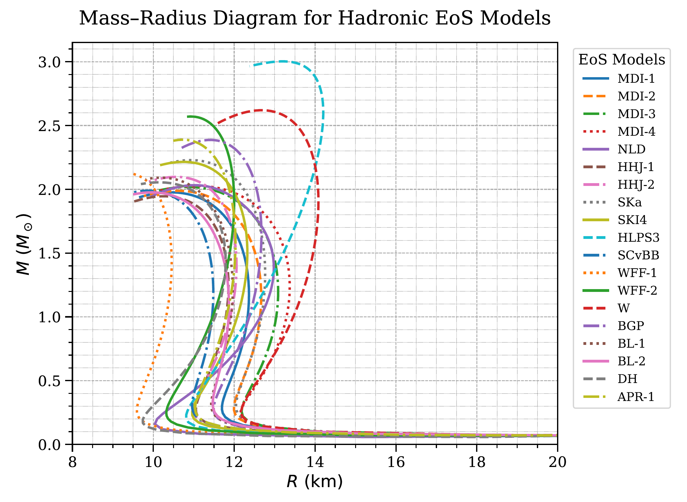
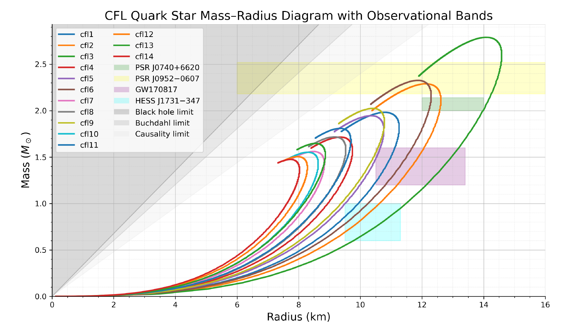
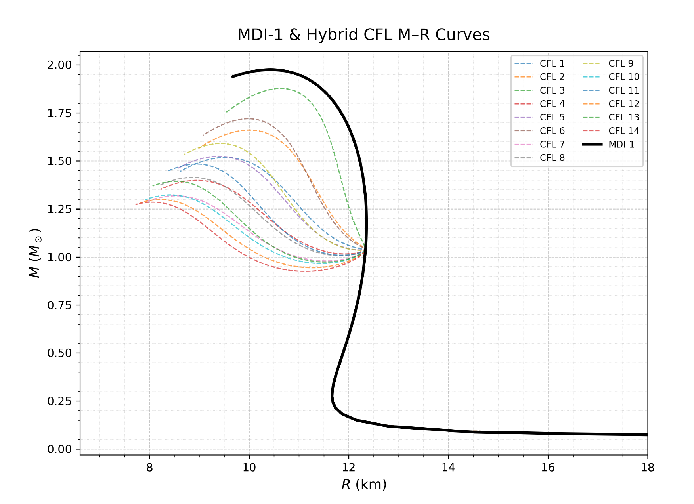
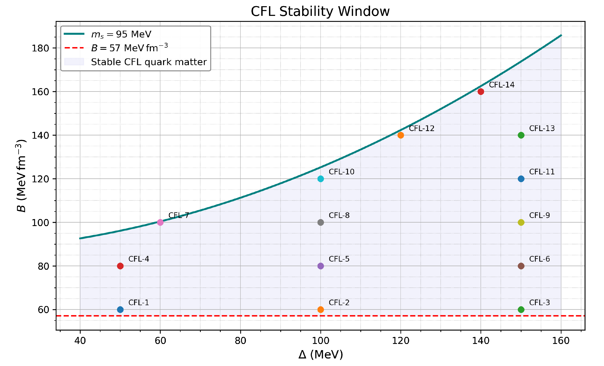

# Neutron-Star-TOV-Solver
# Computational Modeling of Neutron Stars

This repository contains the numerical framework developed for my undergraduate thesis at the **Aristotle University of Thessaloniki**. It solves the structure equations for compact objects and calculates tidal deformability for various Equations of State (EoS).

## Features
- **TOV Solver**: Integration of the Tolman-Oppenheimer-Volkoff equations:
  $$\frac{dP}{dr} = -\frac{G}{r^2} \left( \rho + \frac{P}{c^2} \right) \left( M + \frac{4\pi r^3 P}{c^2} \right) \left( 1 - \frac{2GM}{c^2 r} \right)^{-1}$$
- **Tidal Deformability**: Calculation of the second tidal Love number $k_2$ and the dimensionless parameter $\Lambda$.
- **EoS Support**: 
  - Purely Hadronic (DD2, etc.)
  - Hybrid stars (Maxwell construction)
  - Color-Flavor Locked (CFL) Quark matter using the MIT Bag Model.

## Physical Background
The project investigates the effect of the QCD Cooper-pair gap ($\Delta$) and the bag constant ($B$) on the stability and maximum mass of neutron stars, comparing results with observational constraints from **GW170817** and **NICER**.

## Scientific Results & Visualizations

### 1. Mass-Radius Relations
The following plots illustrate the Mass-Radius sequences for different Equations of State (EoS). The shaded regions and markers represent observational constraints from **NICER** and **GW170817**.

| Hadronic Stars | CFL Quark Stars |
|---|---|
|  |  |

### 2. Hybrid Stars & Phase Transitions
Modeling the transition from hadronic matter to quark matter using Maxwell construction. The plot shows the hybrid branches and the effect of the transition on stellar stability.

### 3. CFL Stability Window
Analysis of the thermodynamic stability of the Color-Flavor Locked phase relative to the nuclear binding energy ($930 \, \text{MeV}$), showing the dependence on the Bag constant $B$ and the gap parameter $\Delta$.

